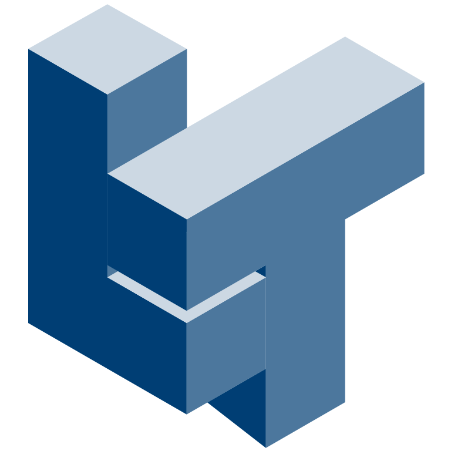

   
  <h2 align="center">Lattice Tessellator</h2>

# LatTessGUI
User interface for Dr Ajit Panesar's LatTess Software

   

## Tutorial Video

## User Guide
A more detailed user guide can be found <a href="/docs/UserGuide.md">here</a>.

## Acknowledgements
+ **[Dr Ajit Panesar](https://www.imperial.ac.uk/people/a.panesar)** - Creator & back-end development.
+ **Eduardo Vila** - Front-end development.
+ **Annie Y Chan** - Finite Element Analysis.
+ **Jamie Porter** - Morphing implementation.
+ **Name** - Project Supporter
